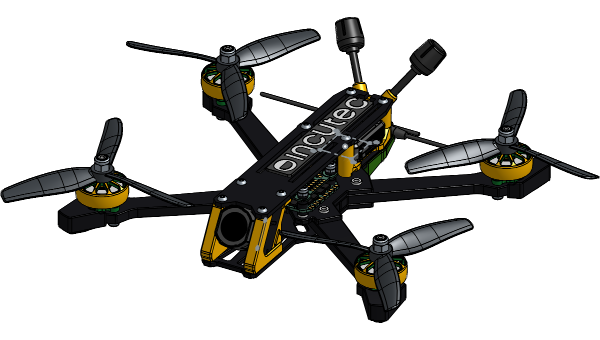
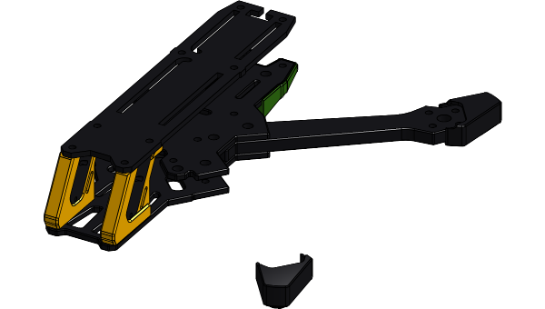

# OpenFrame-5F

The 5" OpenFrame: a CNC carbon fibre freestyle FPV frame in the
incutec OpenDrone line. The 3" and 5" frames are separate repositories:
[OpenFrame-3F](https://github.com/OpenDrone-hw/OpenFrame-3F) and
[OpenFrame-5F](https://github.com/OpenDrone-hw/OpenFrame-5F).

## Where the design lives

| | |
|---|---|
| Source | [Onshape document OpenDrone-V2, workspace 5"](https://cad.onshape.com/documents/78e093d02798373a79bc68d0/w/c0ca752de47c1227bb727503) |
| Link file | [`cad/onshape.json`](cad/onshape.json): document, workspace, element and part ids |
| Released exports | `releases/<rev>/`, written by `onshape_release.py`, never edited |
| Parts per set | [`parts.csv`](parts.csv) |
| Fasteners and hardware | [`hardware.csv`](hardware.csv) |
| Standard | Incutec mechanical repository template (`templates/mechanical-repository` in the hardware tooling) |

## A set

15 part types, 23 pieces, 8 of them carbon. Taken from the
Onshape assembly; materials are as set in the model.

| Part | Qty | Material | Thickness | Made by |
|---|---|---|---|---|
| Arm | 4 | Carbon fiber epoxy (61%) | 6 mm | CNC carbon plate |
| Boot-L | 2 | not set in the model |  |  |
| Boot-R | 2 | not set in the model |  |  |
| Cam-Mount-L | 1 | not set in the model |  |  |
| Cam-Mount-R | 1 | not set in the model |  |  |
| Cross | 1 | Carbon fiber epoxy (61%) | 6 mm | CNC carbon plate |
| Airtag/Antenna mount | 1 | not set in the model |  |  |
| VTX-Mount | 1 | not set in the model |  |  |
| anti-slip pad | 1 | not set in the model |  |  |
| Base-Bot | 1 | Carbon fiber epoxy (61%) |  | CNC carbon plate |
| Base-Top | 1 | Carbon fiber epoxy (61%) |  | CNC carbon plate |
| Top | 1 | Carbon fiber epoxy (61%) |  | CNC carbon plate |
| 18mmx4mm | 4 | Aluminum |  | CNC aluminium |
| Standoff-L | 1 | Aluminum |  | CNC aluminium |
| Standoff-R | 1 | Aluminum |  | CNC aluminium |

Fasteners and hardware per set, from the same assembly:

| Item | Qty |
|---|---|
| Black-Oxide Alloy Steel Hex Drive Flat Head Screw | 5 |
| Hex socket head cap screw M3x0.50 x 8 | 16 |
| Prevailing torque nut M3x0.5 | 4 |
| Socket button head screw M3x0.5 x 12 | 4 |
| Socket button head screw M3x0.5 x 20 | 4 |
| Socket button head screw M3x0.5 x 6 | 8 |
| Socket button head screw M3x0.5 x 8 | 10 |
| m3 pressnut | 10 |
| softmount m2 | 8 |

## Model checks

Found when this repository was set up on 2026-09-25. They stay listed until
the model is fixed.

| Check | Finding |
|---|---|
| Camera mounts | `Cam-Mount-R` is in the frame Part Studio but not in the 5" assembly; the set above counts it |
| Missing parts | The `VTX-Mount` and `anti-slip pad` instances in the 5" assembly point to part ids that no longer exist in the Part Studio |
| Materials | Printed parts have no material set in the model |
| Motor hardware | The assembly's four M5 prop nuts belong to the motors and are left out of `hardware.csv` |

## Dimensions from the last released drawing

| | 5" |
|---|---|
| Top plate | 2.5 mm |
| Middle plate | 3.0 mm |
| Bottom plate | 3.0 mm |
| Cross | 6.0 mm |
| Arm | 6.0 mm |
| Bolt holes | Ø3.1 (M3) |
| Press-nut holes | Ø4.5 (M3) |
| Bolt-head counterbore | Ø5.8 (M3 ISO 7380) |
| Countersink | none |
| Camera mount thread | M3 |

Chamfers 0.5 mm 45°, outer fillets R1.0 mm, inner fillets R1.05 mm unless the
drawing says otherwise. The cross-to-arm interface is a press fit and is the
tightest tolerance in the design.

## Licence

Hardware licensed under [CERN-OHL-S-2.0](https://ohwr.org/cern_ohl_s_v2.txt),
see [LICENSE](LICENSE). Contributing: [CONTRIBUTING.md](CONTRIBUTING.md).
